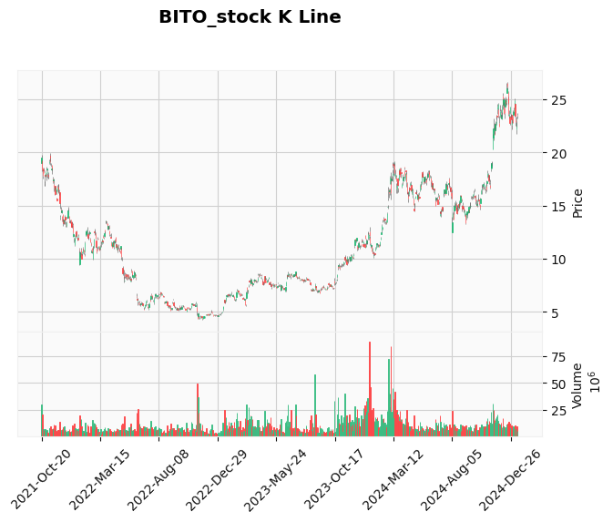
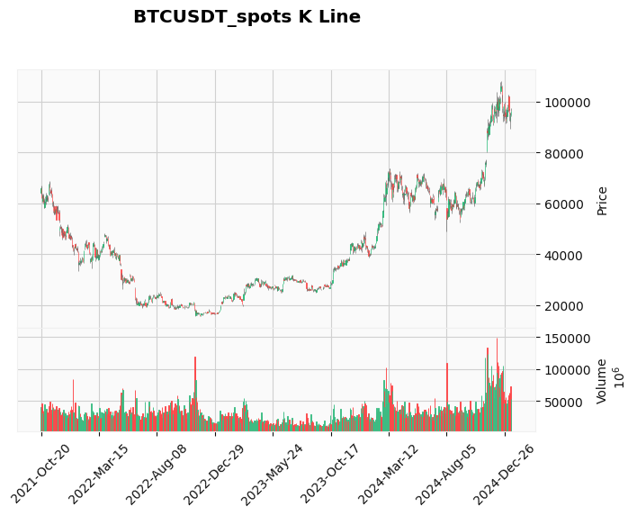

# 数据分析结果

## 结论：（ BITO 和 ibit ） 与 （Btc spots 和 Btc futures) 相关性不足，不建议使用后者预测前者

## IBIT_stock is same as BITO_stock

##### 以下是二者每天close pct之间的相关性，open,high,low 结果类似，都具有非常强的相关性

> Pearson 相关性系数： 0.9992318234890456

> p 值： 0.0

> Spearman 等级相关性系数： 0.998613861165159

> p 值： 1.047e-321

## BTCUSDT_spots is same as BTCUSDT futures

##### 以下是二者每天close pct之间的相关性，open,high,low 结果类似，都具有非常强的相关性

> Pearson 相关性系数： 0.967825495985662

> p 值： 0.0

> Spearman 等级相关性系数： 0.9885031549175616

> p 值： 0.0

## BITO_stock is not same as BTCUSDT_spots

##### 以下是删除二者前500 个交易日数据后二者每天close pct之间的相关性，实验表明两组数据不够相似，并不能直接使用一组数据来拟合另一组数据。open,high,low 相关性更差。如果不删除前 500 个交易日数据，相关性会更差。

> Pearson 相关性系数： 0.9034389470858878

> p 值： 1.0991895806403366e-115

> Spearman 等级相关性系数： 0.9013676579273887

> p 值： 2.4722220249593747e-114

### 以下是对二者close 值处理后求pct，二者在某天 pct相差大于0.01的概率

>> unusual precent: 41.157556270096464 %

### 以下是对二者close 值处理后求pct，二者在某天 pct相差大于0.05的概率

>> unusual precent: 0.6430868167202572 %

## 以下是二者 k 线图

## 以下是二者 MA10 差异图

